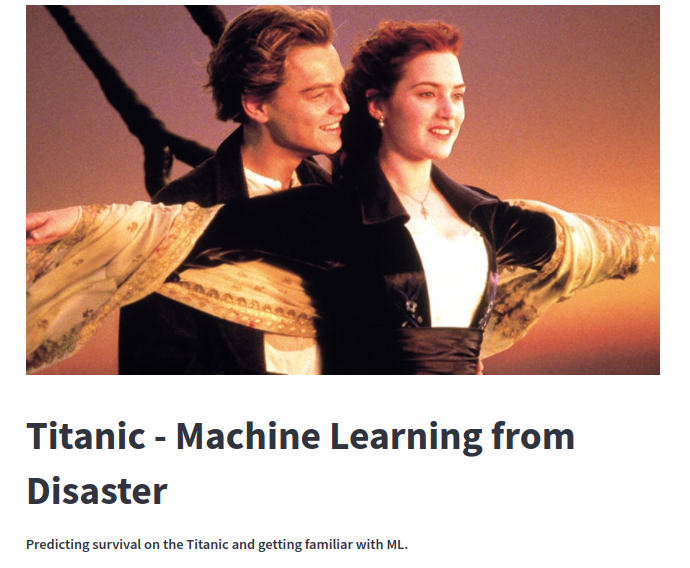
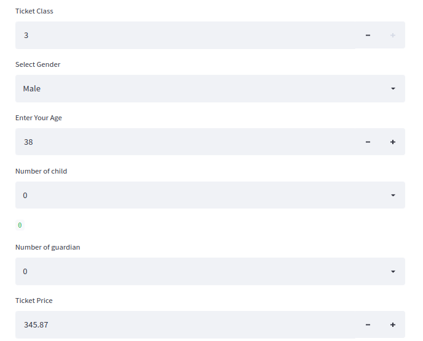
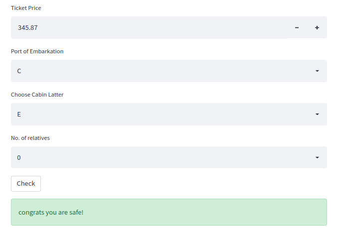

# TitanicSurvivalMachineLearning
using machine learning to create a model that predicts which passengers survived in the Titanic shipwreck.

use **streamlit run app.py** to run this app

## **Note :**
ipynb notebook contains all the data preprocessing, Pipeline Building and final Model buildin part....

lookup of webapp

